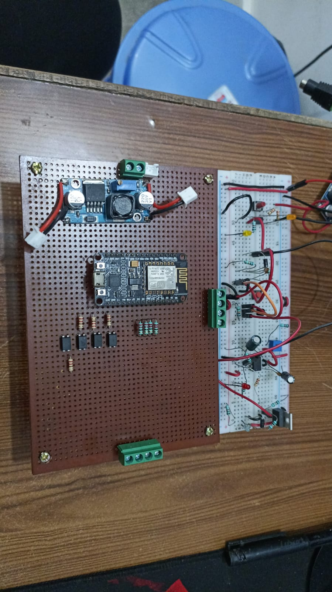
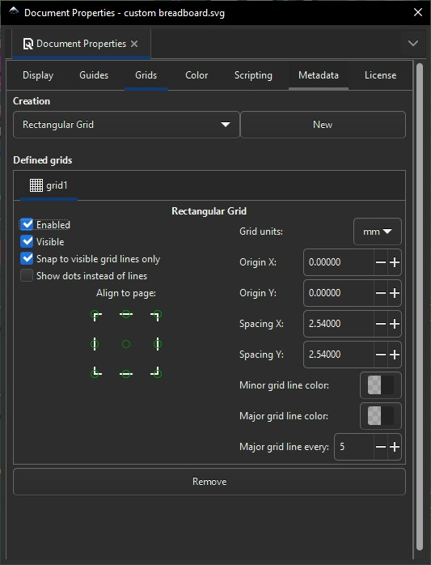
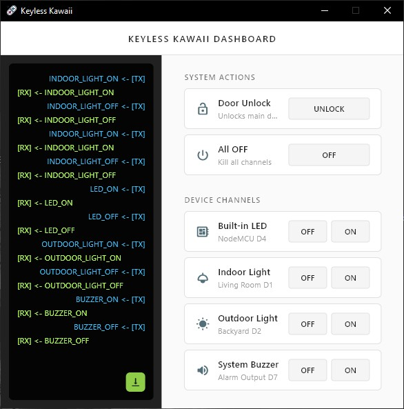
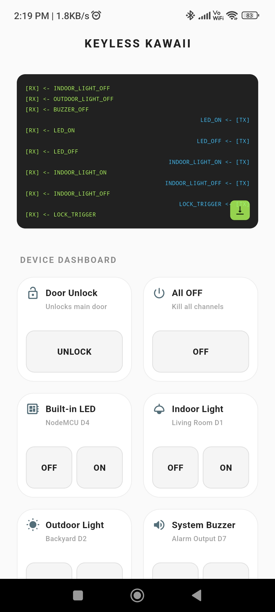

### Hardware Setup

### Design & Schematics

# Keyless Kawaii

**Keyless Kawaii** is a lightweight Flutter application designed to interface with a custom lock controller, allowing the user to interact with physical electronics in real-time over WebSockets. 

On the press of a button, a signal is sent over a WebSocket connection to an **ESP8266 microcontroller**, triggering a sequence of complex electrical circuitry to operate the door lock.

| Windows Desktop App | Android App |
| :---: | :---: |
|  |  |
| Optimized to work seamlessly on **Windows**. | Optimized to work seamlessly on **Android**. |

 

  
   
  
<i>This project also includes a convenient home screen widget (for Android) so you can unlock the door without even opening the app.</i>

*This app is designed primarily for personal use, but feel free to browse the code or take inspiration for your own IoT projects!*

