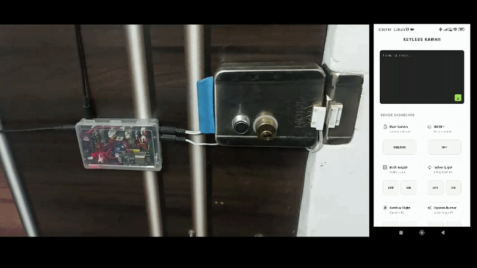

# Keyless Kawaii

**Keyless** is a lightweight personal Flutter application designed to interface with a custom controller circuit, allowing remote control acces to your main door lock.

### The Backstory
Have you ever come back home from a hard day at work, ready to finally rest, only to experience the sudden realization that your keys are missing? Now you're stranded outside your own apartment, embarrassed to ask for help while the neighbor peeps out curiously as you struggle to check every single nook and cranny of your pockets. 

Terrible, right? You are an engineer, this should never happen to you again.

### How It Works
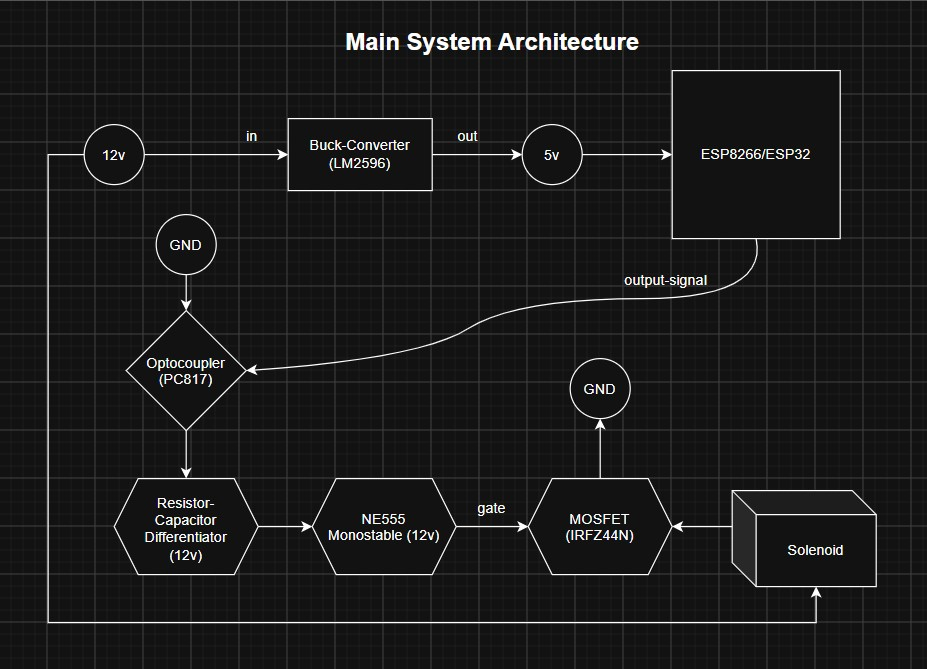

At its core, **Keyless** smoothly bridges the gap between a sleek software interface and heavy-duty hardware actuation. The unlocking sequence begins when the Flutter application whether triggered via the convenient Android widget, the mobile app, or the Windows desktop client sends an instant payload over a local **WebSocket** connection to the **ESP** microcontroller. Upon receiving this command, the ESP fires a standard **3.3V logic signal** to initiate the hardware sequence.

To protect the sensitive microcontroller from the high-power side of the board, this signal first passes through a **PC817 optocoupler** for complete electrical isolation. Because the timing circuit requires a momentary trigger rather than a continuous logic-high signal, an **RC Differentiator** shapes the optocoupler's output into a sharp, brief voltage spike. This spike hits the trigger pin of an **NE555 Timer**, which is configured in a **monostable (one-shot) mode** and powered directly from the 12V rail to ensure a strong output.

Upon triggering, the NE555 fires a single **adjustable 12V pulse** directly into the gate of an **IRFZ44N MOSFET**. An **adjustable trim pot** allows precise control over this activation period. Acting as a **low-side switch**, the MOSFET fully opens to connect the heavy-duty **12V solenoid** to ground, while a flyback diode safely dissipates any induced reverse voltage spikes (inductive kickback). This securely snaps the physical lock mechanism open for the exact duration dictated by the timer before safely resetting, ensuring the solenoid coil never overheats while you walk through the door.

## App Interface

<table>
  <tr>
    <td align="center"></td>
    <td align="center"></td>
    <td align="center">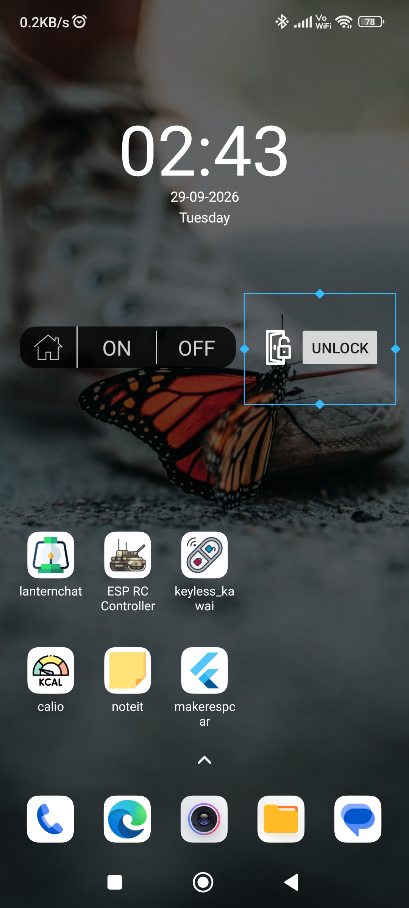</td>
  </tr>
</table>

### Windows Desktop
The app runs silently in the background on **Windows**. Someone rang the doorbell? Just hit `Ctrl + U` to instantly unlock the door. That global shortcut is incredibly convenient, it's one of those things you don't realize you need until you finally have it.

### Android & Custom Widget
The Android app includes a custom home screen widget built in **native Kotlin**. It is an absolute time saver when you're standing outside and just want to get back inside quickly, giving you instant, one-tap unlocking without ever needing to open the app.

---

## Lock Selection

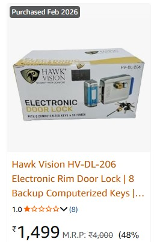

At first, I considered building the entire mechanism from scratch, using my 3D printer to create the base frame and wood for the deadbolt. However, wood simply isn't strong enough to secure a door, which was a major flaw. I then decided to look for an existing metallic lock that I could modify by adding a servo motor. This approach would have solved another major requirement: keeping a physical key as a fallback just in case the electronics ever failed.

During my search, I stumbled upon a lock with a built-in 12V solenoid. It was an absolute jackpot!

But there was a catch: it had terrible reviews and was strictly non-returnable. Reading through the complaints, I quickly realized that everyone who bought it was using it incorrectly. They were hooking it up directly to a constant 12V power supply, which immediately burned out the solenoid coil. The lock is sold completely bare, without any timing or protection circuitry. In fact, the manual explicitly warns that applying current for more than 8 seconds will destroy the coil. Without proper electronics knowledge, burning out this lock is practically guaranteed.

## Electronic Parts

As an electronics hobbyist, my lab is already filled with countless modules, capacitors, resistors, and transistors. Since this wasn't my first time designing circuits, I didn't actually have to buy anything for this project other than the lock itself.

---

> 🚧 **Work In Progress**
> 
> This `README.md` is currently incomplete. I am leaving the rest of the draft as-is for now while I shift focus to another project, but I plan to return and give this repository the proper documentation it deserves. 
> 
> I have included a few additional screenshots at the bottom for reference, and I will add more technical details later. Thank you for checking out the project!

---

### Enclosure & Overview
| Enclosure Showcase | Overall Schematic |
| :---: | :---: |
| 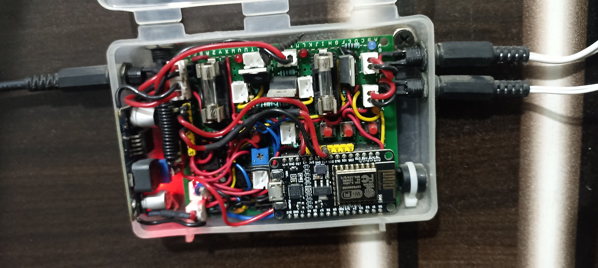 | 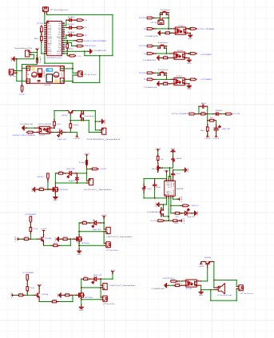 |

### Circuit Breakdown
| Power Supply & ESP | Adjustable NE555 Configuration |
| :---: | :---: |
| 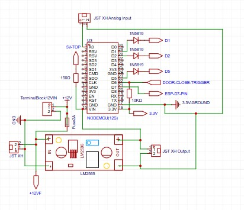 | 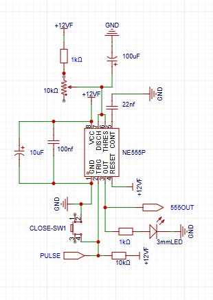 |

| Pulse Generator | Lock Trigger |
| :---: | :---: |
| 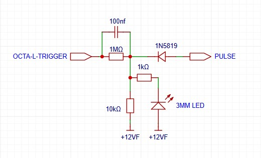 | 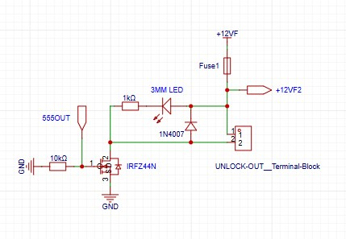 |

| Buzzer Attachment | Door Closing Sensor & Input Protection |
| :---: | :---: |
|  | 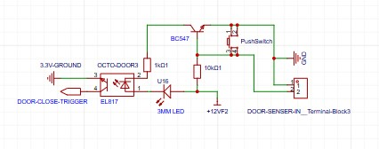 |

| Debugging Switches & Output Protection | External One Trigger |
| :---: | :---: |
| 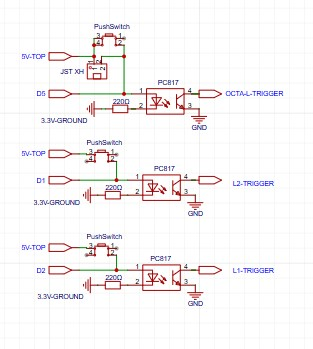 | 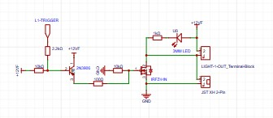 |

| External Two Trigger | |
| :---: | :---: |
| 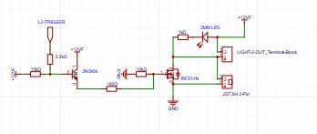 | |

---

### Hardware Assembly & Prototyping

| Hardware Setup | Design & Schematics |
| :---: | :---: |
| 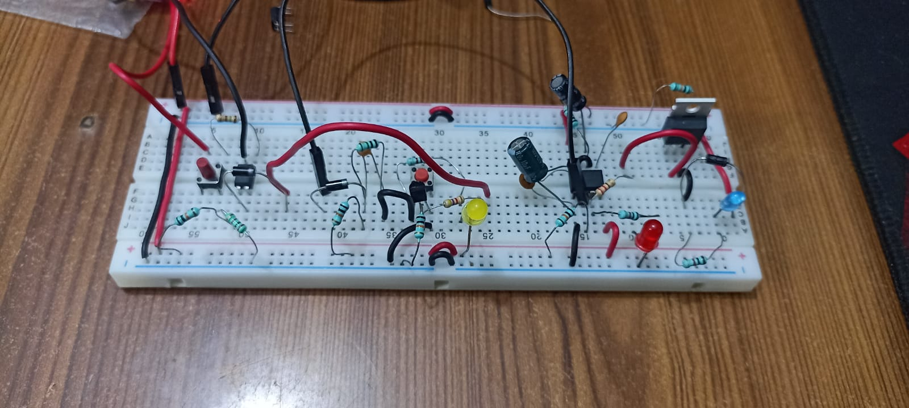  | 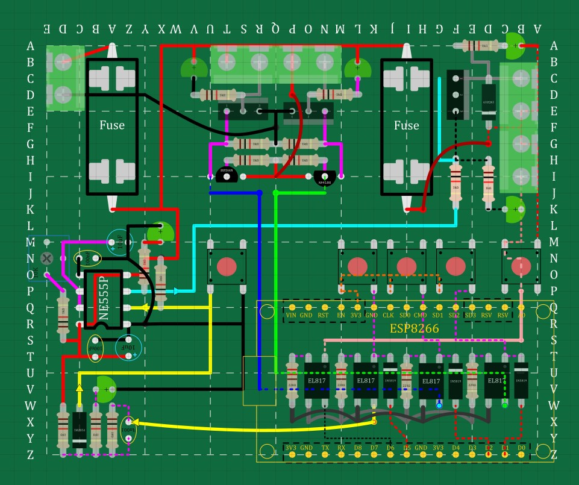  |

---

*This app is designed primarily for personal use, but feel free to browse the code or take inspiration for your own IoT projects!*